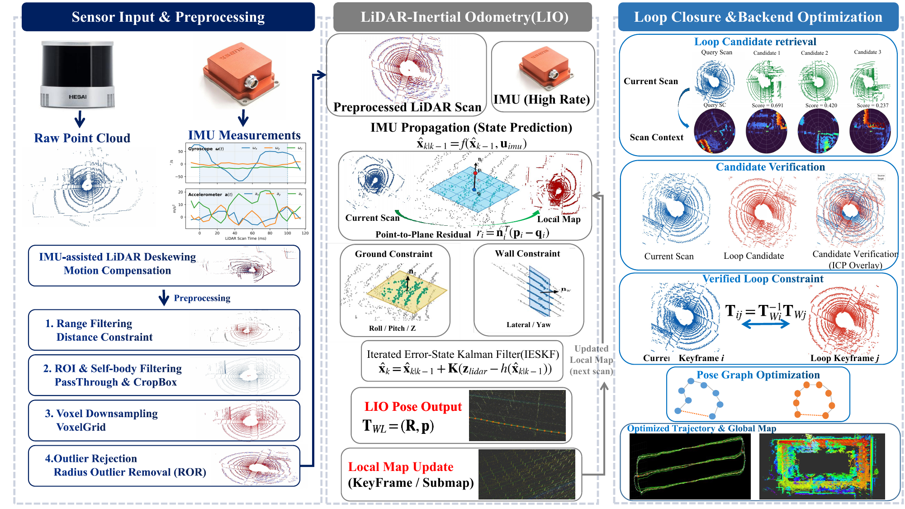

# FR-SLAM

**FR-SLAM** is a ROS 2 LiDAR SLAM system with LiDAR-inertial odometry, structural constraints, loop closure, pose-graph optimization, CUDA acceleration, and global mapping.

## System Overview



[System overview PDF](docs/FR_SLAM_Overview.pdf) · [Technical overview](docs/FR_SLAM_Technical_Overview.md)

## Highlights

- LiDAR-Inertial Odometry with IESKF
- Ground and wall structural constraints
- Scan Context loop-candidate retrieval
- Geometric loop verification and g2o pose-graph optimization
- Asynchronous post-PGO map refinement
- CUDA exact dense-grid KNN
- Fast analytic plane eigensolver with Jacobi fallback
- Timestamped optimized / refined map export

## Representative Accuracy

Results on the **Strawberry_4** evaluation sequence:

| Metric | FR-SLAM | FAST-LIO2 |
|---|---:|---:|
| Translation RMSE | **0.1439 m** | 0.1803 m |
| Rotation RMSE | 0.8004° | **0.6508°** |
| Z RMSE | 0.0464 m | **0.0286 m** |

A validated Preserve-Z PGO configuration achieved **0.0994 m global ATE** and **0.0357 m Z RMSE**.
<!--  -->
> Results are dataset- and configuration-dependent.

## Build

```bash
cd ~/ros2_ws

colcon build \
  --packages-select fr_slam \
  --cmake-args \
  -DCMAKE_BUILD_TYPE=Release \
  -DCMAKE_EXPORT_COMPILE_COMMANDS=ON \
  '-DCMAKE_CXX_FLAGS_RELEASE=-O3 -DNDEBUG -march=native -mtune=native'

source ~/ros2_ws/install/setup.bash
```

## Run

Example HortiMulti outdoor LIO:

```bash
ros2 launch fr_slam lio.launch.py \
  sensor:=hortimulti \
  profile:=outdoor \
  backend_loop_closure_enable:=true \
  ground_constraint_enable:=true \
  wall_constraint_enable:=true \
  planar_motion_mode:=false
```

## Save Maps

```bash
ros2 service call /save_slam_maps std_srvs/srv/Trigger "{}"
```

## Demo

https://github.com/user-attachments/assets/b335c305-ebd7-4d81-80b5-f00bc73c70aa

## Documentation

Detailed system architecture, backend refinement, accuracy, and runtime optimization notes are available in:

[**FR-SLAM Technical Overview**](docs/FR_SLAM_Technical_Overview.md)

## License

Apache-2.0
