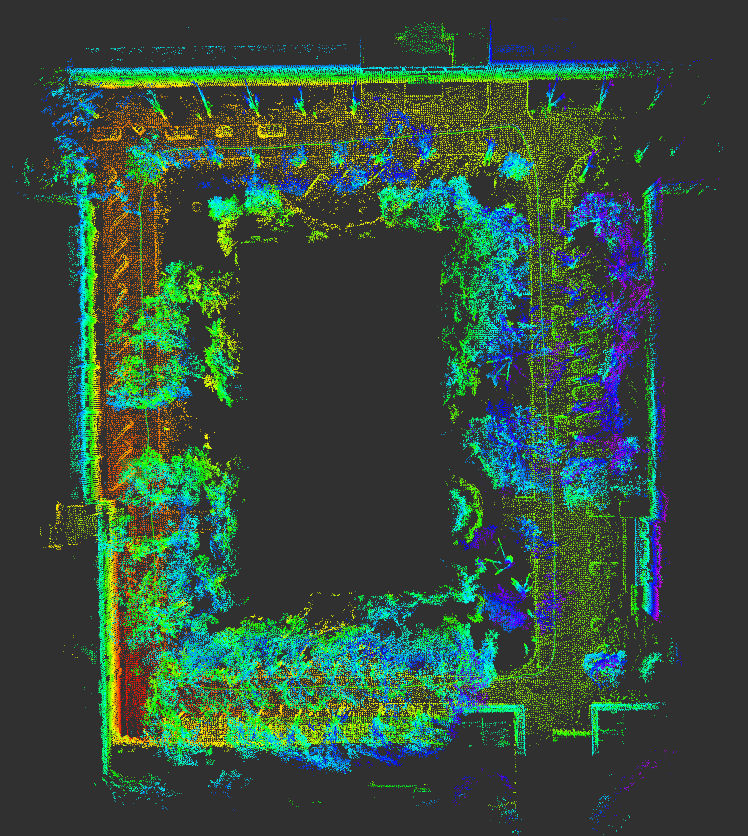
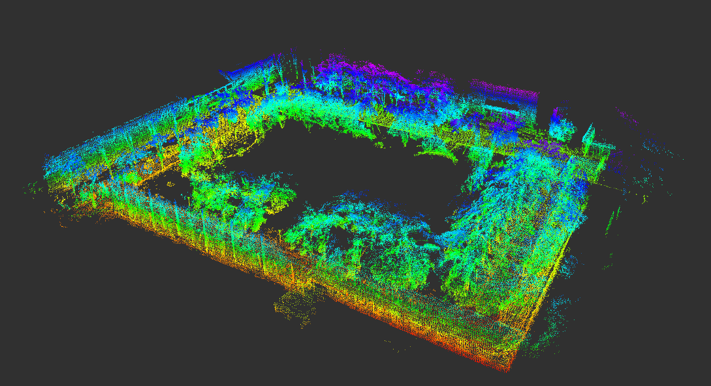

# FR-SLAM

FR-SLAM is a ROS 2 LiDAR SLAM system supporting LiDAR-Inertial Odometry (LIO), structural constraints, loop closure, pose-graph optimization, CUDA-accelerated loop verification, post-PGO map refinement, and global map export.

## System Overview


[System Overview PDF](docs/FR_SLAM_Overview.pdf) · [Technical Documentation](docs/FR_SLAM_Technical_Overview.md)

## Build

Tested with ROS 2 Humble.

```bash
cd ~/ros2_ws

colcon build \
  --packages-select fr_slam \
  --cmake-args \
  -DCMAKE_BUILD_TYPE=Release \
  -DCMAKE_EXPORT_COMPILE_COMMANDS=ON \
  '-DCMAKE_CXX_FLAGS_RELEASE=-O3 -DNDEBUG -march=native -mtune=native'

source ~/ros2_ws/install/setup.bash
```

## Run

### HortiMulti / Outdoor

```bash
ros2 launch fr_slam lio.launch.py \
  sensor:=hortimulti \
  profile:=outdoor \
  backend_loop_closure_enable:=true \
  ground_constraint_enable:=true \
  wall_constraint_enable:=true \
  planar_motion_mode:=false
```

### Livox

```bash
ros2 launch fr_slam lio.launch.py \
  sensor:=livox \
  profile:=indoor \
  backend_loop_closure_enable:=true \
  ground_constraint_enable:=true \
  planar_motion_mode:=false
```

### Hesai

```bash
ros2 launch fr_slam lio.launch.py \
  sensor:=hesai \
  profile:=outdoor \
  backend_loop_closure_enable:=true \
  ground_constraint_enable:=true \
  planar_motion_mode:=false
```

## Save Map and Trajectory

```bash
ros2 service call /save_slam_maps std_srvs/srv/Trigger "{}"
```

Each save creates a separate timestamped output directory.

## Post-PGO Refinement

The HortiMulti configuration supports:

```yaml
post_pgo_refinement_mode: "off"    # final refinement only when saving
post_pgo_refinement_mode: "sync"   # synchronous online refinement
post_pgo_refinement_mode: "async"  # background refinement worker
```

Current HortiMulti configuration:

```yaml
post_pgo_refinement_mode: "async"
post_pgo_refinement_loop_stride: 8
```


## Mapping Results

**Top View**



**3D View**



## Documentation

More detailed architecture and implementation notes are available in:

[FR-SLAM Technical Overview](docs/FR_SLAM_Technical_Overview.md)

## License

Apache-2.0
